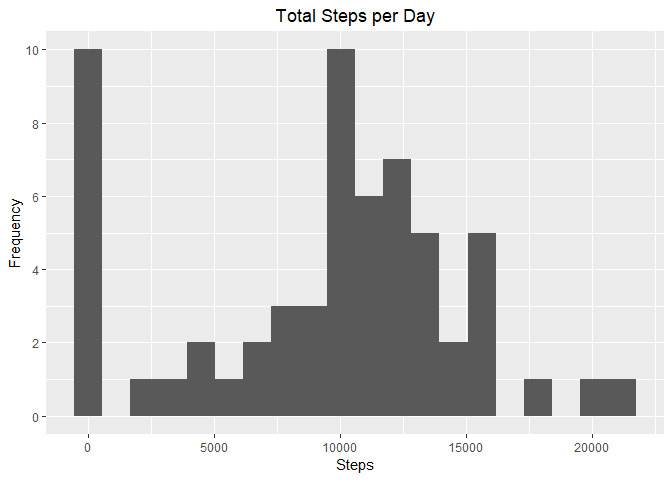
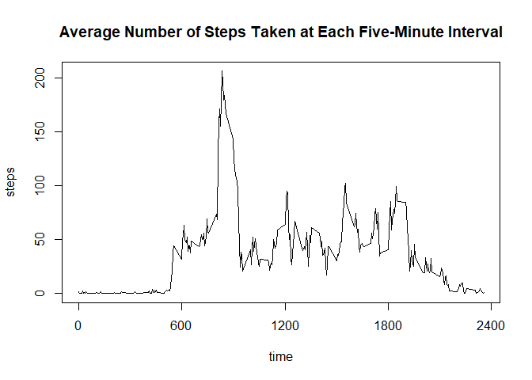
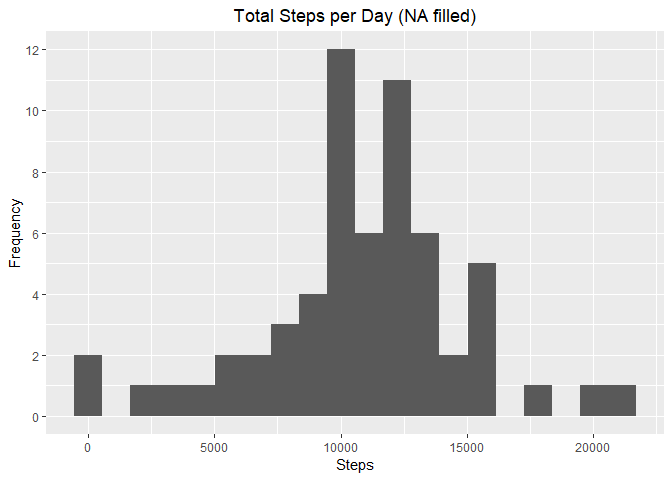

## Loading and preprocessing the data
Clearing workspace and loading libraries (hiding messages):

```r
rm(list = ls())
library(lubridate)
library(ggplot2)
library(dplyr)
library(readr)
library(reshape2)
```

#### 1. Load the data(i.e. read.csv)  

Unzipping and loading file:

```r
unzip("activity.zip")
activity <- read.csv("activity.csv")
str(activity)
```

```
## 'data.frame':	17568 obs. of  3 variables:
##  $ steps   : int  NA NA NA NA NA NA NA NA NA NA ...
##  $ date    : Factor w/ 61 levels "2012-10-01","2012-10-02",..: 1 1 1 1 1 1 1 1 1 1 ...
##  $ interval: int  0 5 10 15 20 25 30 35 40 45 ...
```

```r
head(activity)
```

```
##   steps       date interval
## 1    NA 2012-10-01        0
## 2    NA 2012-10-01        5
## 3    NA 2012-10-01       10
## 4    NA 2012-10-01       15
## 5    NA 2012-10-01       20
## 6    NA 2012-10-01       25
```
#### 2. Process/transform the data into a format suitable for your analysis  

Setting date:

```r
activity$date <- ymd(activity$date)
```

Checking for NA values:

```r
mean(is.na(activity$steps))
```

```
## [1] 0.1311475
```

```r
mean(is.na(activity$date))
```

```
## [1] 0
```

```r
mean(is.na(activity$interval))
```

```
## [1] 0
```

## What is mean total number of steps taken per day?
#### 1. Calculate the the total number of steps taken per day    

Making a dataset with total steps per day: 

```r
daily <- with(activity, tapply(steps, date, sum, na.rm = T))
daily <- data.frame(date = names(daily), steps = daily)
daily$date <- ymd(daily$date)
str(daily)
```

```
## 'data.frame':	61 obs. of  2 variables:
##  $ date : Date, format: "2012-10-01" "2012-10-02" ...
##  $ steps: int [1:61(1d)] 0 126 11352 12116 13294 15420 11015 0 12811 9900 ...
```

```r
head(daily)
```

```
##                  date steps
## 2012-10-01 2012-10-01     0
## 2012-10-02 2012-10-02   126
## 2012-10-03 2012-10-03 11352
## 2012-10-04 2012-10-04 12116
## 2012-10-05 2012-10-05 13294
## 2012-10-06 2012-10-06 15420
```

#### 2. Make a histogram of the total number of steps taken each day  

Histogram of total daily steps:

```r
gDaily <- ggplot(daily, aes(x = steps)) + geom_histogram(bins = 20) + 
    labs(x = "Steps", y = "Frequency", title = "Total Steps per Day") + 
    scale_y_continuous(breaks = c(0, 2, 4, 6, 8, 10)) +
    theme(plot.title = element_text(hjust = 0.5)) 
gDaily
```

<!-- -->

#### 3. Calculate and report the mean and median of the total number of steps taken per day  

Mean and median of total number of steps taken per day:

```r
dailySummary <- summary(daily$steps)
dailySummary
```

```
##    Min. 1st Qu.  Median    Mean 3rd Qu.    Max. 
##       0    6778   10395    9354   12811   21194
```

```r
rm(daily)
```

## What is the average daily activity pattern?

#### 1. Make a time series plot of the 5-minute interval (x-axis) and the average number of steps taken, averaged across all days (y-axis)  

Making a dataset with average steps per five-minute interval: 

```r
interval <- with(activity, tapply(steps, interval, mean, na.rm = T))
interval <- data.frame(time = names(interval), steps = interval)
interval$time <- as.numeric(as.character(interval$time))
head(interval)
```

```
##    time     steps
## 0     0 1.7169811
## 5     5 0.3396226
## 10   10 0.1320755
## 15   15 0.1509434
## 20   20 0.0754717
## 25   25 2.0943396
```

```r
str(interval)
```

```
## 'data.frame':	288 obs. of  2 variables:
##  $ time : num  0 5 10 15 20 25 30 35 40 45 ...
##  $ steps: num [1:288(1d)] 1.717 0.3396 0.1321 0.1509 0.0755 ...
```

Plotting average number of steps taken at each interval

```r
par(bg = NA) 
with(interval, plot(x = time, y = steps, type = "l", xaxt = "n"))
axis(1, at = c(0000, 0600, 1200, 1800, 2400))
title("Average Number of Steps Taken at Each Five-Minute Interval")
```

<!-- -->

#### 2. Which 5-minute interval, on average across all the days in the dataset, contains the maximum number of steps?  

Five-minute interval that has the maximum number of steps:

```r
interval[which.max(interval$steps), ]
```

```
##     time    steps
## 835  835 206.1698
```
There is most activity at 0835.

## Imputing missing values
Total number of missing values. 

#### 1. Calculate and report the total number of missing values in the dataset 


```r
sum(is.na(activity$steps))
```

```
## [1] 2304
```

#### 2. Devise a strategy for filling in all of the missing values in the dataset.
Activity likely shows a weekly pattern, i.e., a person does the same thing every 
Monday at 8 am. Using mean of day-of-week and time to impute values.  

First checking if any of the day-of-week/time pairings are all NA's. For 
example, if every single Sunday at 0500 is NA. The minimum number of "notna" 
should be more than 0.

```r
nas <- activity 
nas$dayOfWeek <- as.factor(wday(nas$date))
nas <- cbind(nas, notna = !is.na(activity$steps))
min(with(nas, tapply(notna, list(interval, dayOfWeek), sum)))
```

```
## [1] 7
```

```r
rm(nas)
```

Getting day-of-week averages.

```r
activity$dayOfWeek <- wday(activity$date)
intervalByDay <- with(activity, tapply(steps, list(interval, dayOfWeek), 
                                       mean, na.rm = T))
intervalByDay <- data.frame(time = rownames(intervalByDay), intervalByDay)
intervalByDay <- melt(intervalByDay, id = "time", measures.vars = 
                          c("X1", "X2", "X3", "X4", "X5", "X6", "X7"))
names(intervalByDay) <- c("interval", "dayOfWeek", "aveSteps")
intervalByDay$dayOfWeek <- parse_number(intervalByDay$dayOfWeek)
```
Comparing both tables to see that everything is on-track. 

```r
head(intervalByDay)
```

```
##   interval dayOfWeek aveSteps
## 1        0         1 0.000000
## 2        5         1 0.000000
## 3       10         1 0.000000
## 4       15         1 0.000000
## 5       20         1 0.000000
## 6       25         1 7.428571
```

```r
head(activity)
```

```
##   steps       date interval dayOfWeek
## 1    NA 2012-10-01        0         2
## 2    NA 2012-10-01        5         2
## 3    NA 2012-10-01       10         2
## 4    NA 2012-10-01       15         2
## 5    NA 2012-10-01       20         2
## 6    NA 2012-10-01       25         2
```

```r
str(intervalByDay)
```

```
## 'data.frame':	2016 obs. of  3 variables:
##  $ interval : Factor w/ 288 levels "0","10","100",..: 1 226 2 73 136 195 198 209 212 223 ...
##  $ dayOfWeek: num  1 1 1 1 1 1 1 1 1 1 ...
##  $ aveSteps : num  0 0 0 0 0 ...
```

```r
str(activity)
```

```
## 'data.frame':	17568 obs. of  4 variables:
##  $ steps    : int  NA NA NA NA NA NA NA NA NA NA ...
##  $ date     : Date, format: "2012-10-01" "2012-10-01" ...
##  $ interval : int  0 5 10 15 20 25 30 35 40 45 ...
##  $ dayOfWeek: num  2 2 2 2 2 2 2 2 2 2 ...
```

Merging and filling values:


```r
activityFilled <- merge(activity, intervalByDay, 
                        by = c("interval", "dayOfWeek"))
activityFilled$stepsFilled <- activityFilled$steps
activityFilled[is.na(activityFilled$stepsFilled), ]$stepsFilled <-
    activityFilled[is.na(activityFilled$stepsFilled), ]$aveSteps
```

#### 3. Create a new dataset that is equal to the original dataset but with the missing data filled in.
Data already created, cleaning up:

```r
activityFilled <- activityFilled %>% select(-c("steps", "aveSteps")) %>% 
    rename(steps = stepsFilled)
str(activityFilled)
```

```
## 'data.frame':	17568 obs. of  4 variables:
##  $ interval : int  0 0 0 0 0 0 0 0 0 0 ...
##  $ dayOfWeek: num  1 1 1 1 1 1 1 1 2 2 ...
##  $ date     : Date, format: "2012-11-04" "2012-11-25" ...
##  $ steps    : num  0 0 0 0 0 ...
```

```r
head(activityFilled)
```

```
##   interval dayOfWeek       date steps
## 1        0         1 2012-11-04     0
## 2        0         1 2012-11-25     0
## 3        0         1 2012-10-21     0
## 4        0         1 2012-10-14     0
## 5        0         1 2012-10-28     0
## 6        0         1 2012-10-07     0
```

```r
rm(interval, intervalByDay)
```

#### 4. Make a histogram of the total number of steps taken each day and calculate and report the mean and median total number of steps taken per day. Do these values differ from the estimates from the first part of the assignment? What is the impact of imputing missing data on the estimates of the total daily number of steps?

Making a dataset with total steps per day: 

```r
dailyFilled <- with(activityFilled, tapply(steps, date, sum, na.rm = T))
dailyFilled <- data.frame(date = names(dailyFilled), steps = dailyFilled)
dailyFilled$date <- ymd(dailyFilled$date)
str(dailyFilled)
```

```
## 'data.frame':	61 obs. of  2 variables:
##  $ date : Date, format: "2012-10-01" "2012-10-02" ...
##  $ steps: num [1:61(1d)] 9975 126 11352 12116 13294 ...
```

```r
head(dailyFilled)
```

```
##                  date     steps
## 2012-10-01 2012-10-01  9974.857
## 2012-10-02 2012-10-02   126.000
## 2012-10-03 2012-10-03 11352.000
## 2012-10-04 2012-10-04 12116.000
## 2012-10-05 2012-10-05 13294.000
## 2012-10-06 2012-10-06 15420.000
```
Then the histogram:

```r
gFilled <- ggplot(dailyFilled, aes(x = steps)) + geom_histogram(bins = 20) + 
    labs(x = "Steps", y = "Frequency") + 
    labs(title = "Total Steps per Day (NA filled)") + 
    scale_y_continuous(breaks = c(0, 2, 4, 6, 8, 10, 12)) +
    theme(plot.title = element_text(hjust = 0.5)) 
gFilled
```

<!-- -->

Reporting the mean and median:

```r
filledSummary <- summary(dailyFilled$steps)
filledSummary
```

```
##    Min. 1st Qu.  Median    Mean 3rd Qu.    Max. 
##      41    8918   11015   10821   12811   21194
```

```r
rm(dailyFilled)
```
Recall the unfilled data: 

```r
dailySummary
```

```
##    Min. 1st Qu.  Median    Mean 3rd Qu.    Max. 
##       0    6778   10395    9354   12811   21194
```
Imputing the missing steps increases the number of steps.

## Are there differences in activity patterns between weekdays and weekends?

#### 1. Create a new factor variable in the dataset with two levels - "weekday" and "weekend" indicating whether a given date is a weekday or weekend day.


```r
activityFilled$isWeekend <- factor(activityFilled$dayOfWeek %in% c(1, 7), 
                                   levels = c(FALSE, TRUE), 
                                   labels = c("weekday", "weekend"))
str(activityFilled)
```

```
## 'data.frame':	17568 obs. of  5 variables:
##  $ interval : int  0 0 0 0 0 0 0 0 0 0 ...
##  $ dayOfWeek: num  1 1 1 1 1 1 1 1 2 2 ...
##  $ date     : Date, format: "2012-11-04" "2012-11-25" ...
##  $ steps    : num  0 0 0 0 0 ...
##  $ isWeekend: Factor w/ 2 levels "weekday","weekend": 2 2 2 2 2 2 2 2 1 1 ...
```

#### 2. Make a panel plot containing a time series plot (i.e. type = "l") of the 5-minute interval (x-axis) and the average number of steps taken, averaged across all weekday days or weekend days (y-axis).

Making the data set, then reshaping it to use it with facets:

```r
interval <- with(activityFilled, tapply(steps, list(interval, isWeekend), 
                                        mean, na.rm = T))
interval <- data.frame(time = rownames(interval), interval)
interval$time <- as.numeric(as.character(interval$time))
str(interval)
```

```
## 'data.frame':	288 obs. of  3 variables:
##  $ time   : num  0 5 10 15 20 25 30 35 40 45 ...
##  $ weekday: num  2.3107 0.45 0.175 0.2 0.0889 ...
##  $ weekend: num  0 0 0 0 0 ...
```

```r
head(interval)
```

```
##    time    weekday  weekend
## 0     0 2.31071429 0.000000
## 5     5 0.45000000 0.000000
## 10   10 0.17500000 0.000000
## 15   15 0.20000000 0.000000
## 20   20 0.08888889 0.000000
## 25   25 1.56388889 3.714286
```

```r
interval <- melt(interval, id = "time", measures.vars = c("weekday", "weekend"))
interval <- rename(interval, day = variable, steps = value)
str(interval)
```

```
## 'data.frame':	576 obs. of  3 variables:
##  $ time : num  0 5 10 15 20 25 30 35 40 45 ...
##  $ day  : Factor w/ 2 levels "weekday","weekend": 1 1 1 1 1 1 1 1 1 1 ...
##  $ steps: num  2.3107 0.45 0.175 0.2 0.0889 ...
```

```r
head(interval)
```

```
##   time     day      steps
## 1    0 weekday 2.31071429
## 2    5 weekday 0.45000000
## 3   10 weekday 0.17500000
## 4   15 weekday 0.20000000
## 5   20 weekday 0.08888889
## 6   25 weekday 1.56388889
```

Plot graph:

```r
g <- ggplot(interval, aes(x = time, y = steps)) + facet_grid(day ~ .) + 
    labs(x = "Time", y = "Number of Steps") + 
    labs(title = "Weekday vs Weekend Steps") +
    theme(plot.title = element_text(hjust = 0.5)) +
    geom_line() + scale_x_continuous(breaks = c(0, 600, 1200, 1800, 2400))
g
```

<!-- -->
  
During the weekends, there is more activity between 0900 and 1800. Morning 
activity at 0830 spikes higher during weekdays.
